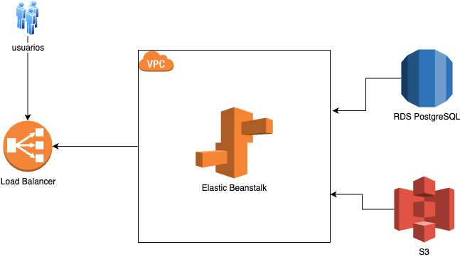

# Challenger Dev Python Senior

Se crea un sistema de registro de infracciones de transito, usando Django y Django-Rest Framework para este caso. En los cuales se crea un administraodor de creacion de usuarios, oficiales, vehiculos, y control de infracciones cargados por los oficiales.

Se usa ademas una libreria de JWT (Simple JWT) compatible con Django para el manejo de autenticacion.


## Instalacion

Para instalar localmente sin usar Docker

```bash
git clone git@github.com:jcroot/challenger.git
cd challenger
python3 -m venv env
source env/bin/activate
pip install --upgrade pip
pip install -r requirements.txt
cp conf/.env.example conf/.env # edite este archivo y coloque su configuracion
./manage.py migrate
./manages.py createsu # aqui creamos un superusuario
./manage.py runserver
```

en caso que quiera usar docker-compose
```bash
git clone git@github.com:jcroot/challenger.git
cd challenger
cp conf/.env.example conf/.env # edite este archivo y coloque su configuracion
docker-compose up -d --build
docker-compose exec backend ./manage.py createsu # aqui creamos un superusuario
```


## Arquitectura AWS

La arquitectura propuesta es la uitlizacion de:

* Elastic Load Balancer: Para conseguir balancear la carga a las aplicaciones levantadas en la VPC
* Elastic Beanstalk: Levantar n cantidad de instancias en un serverless, para ofrecer un servicio sobre demanda. Es decir, a mas cantidad de acceso, mas escalibilidad
* RDS PostgreSQL: Base de datos relacional para almacenar los datos
* S3: Sirve tanto para almacenar las aplicaciones en EBS, e imagenes que se pudieran registrar de los vehiculos o de los documentos de propietarios.
* VPC: Solo para acceso limitado. 



## Supuestos

[Leer supuestos](https://github.com/jcroot/challenger/blob/78b92582b5bf0ced25e699f7311781ca8e586150/supuestos.txt)

